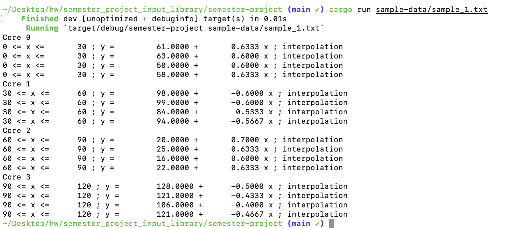

# Semester Project - CPU Temps

# Requirements

## Language

This project will be built using the Rust langauge (1.73.0)

## Installed Packages

temperature-parser 0.1.0
regex 1
lazy_static 1.4.0

# Compilation

The code can be compiled using Rust's built in build system, cargo.

Creating an executable

```
cargo build --release
```

Running through cargo

```
cargo run
```

# Sample Execution & Output

## Execution

```
cargo run <fileName>
```

## Output

Output rendered during execution of the program

Multiple output files will be created where the program was executed that consist of the format

```
<input file's base name>-core-<column number>.txt
```

The contents of each file will be similar to the the lines in the program's console output separated by the core. Each core will have its own file.

# Documentation

Accessible via the cargo command

```
cargo doc --open
```
